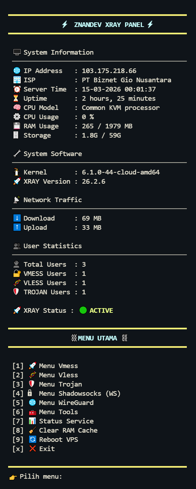

# Autoscript XRAY 

AutoScript VPN all-in-one 
Script modular dan interaktif untuk install protokol VPN lengkap dengan panel: **XRAY (VMess, VLess, Trojan, Shadowsocks), WireGuard**, dan berbagai tools DevOps + monitoring.

---
## Fitur Utama

- XRAY: Vmess, Vless, Trojan, Shadowsocks (WS + gRPC)
- WireGuard VPN
- Installer WebSocket custom
- Menu interaktif per protokol
- Tools tambahan: Backup, Domain, Speedtest
- Setup domain random/manual

---
## Screenshot


Untuk membuka menu
```bash
sudo menu
```


---
## Quick Install
```bash
# 1. Install dependensi dasar
apt update -y && apt upgrade -y && apt install git curl screen sudo -y

# 2. Disable IPv6
sysctl -w net.ipv6.conf.all.disable_ipv6=1
sysctl -w net.ipv6.conf.default.disable_ipv6=1

# 3. Clone repo dari GitHub
git clone https://github.com/znandev/AutoscriptXRAY.git
cd AutoscriptXRAY

# 4. Jalankan installer via screen
chmod +x setup.sh
chmod +x uninstall.sh
screen -S setup ./setup.sh
```
---
## Struktur Direktori

```bash
autoscript_znand/
├── install.sh            # Master installer (internal)
├── setup.sh              # Entry point buat user (via screen)
├── menu.sh               # Menu utama
├── install/              # Sub-installer per protokol
│   ├── ssh.sh
│   ├── wg.sh
│   ├── websocket.sh
│   └── xray.sh
├── ssh/
│   ├── m-sshovpn
│   ├── add-ssh.sh
│   ├── del-ssh.sh
│   ├── cek-login.sh
│   ├── cek-aktif.sh
│   └── restart-ssh.sh
├── wg/
│   ├── m-wg
│   ├── wg-add.sh
│   ├── wg-del.sh
│   └── wg-show.sh
├── websocket/
│   ├── restart-ws.sh
│   ├── service-install.sh
│   └── stop-ws.sh
├── xray/
│   ├── m-vmess
│   ├── m-vless
│   ├── m-trojan
│   ├── m-ssws
│   ├── add-*.sh, del-*.sh, cek-*.sh, renew-*.sh (semua protokol)
├── tools/
│   ├── tools-menu
│   ├── backup.sh
│   ├── domain.sh
│   └── speedtest.sh
```

---

## Kompatibilitas

| OS           | Status    |
|--------------|-----------|
| Debian 10    | ✅ Supported |
| Debian 11    | ✅ Supported |
| Ubuntu 20.04 | ✅ Supported |
| Ubuntu 22.04 | ✅ Supported |
| OpenVZ       | ❌ Not supported |
| KVM/VMWare   | ✅ Recommended |

---
