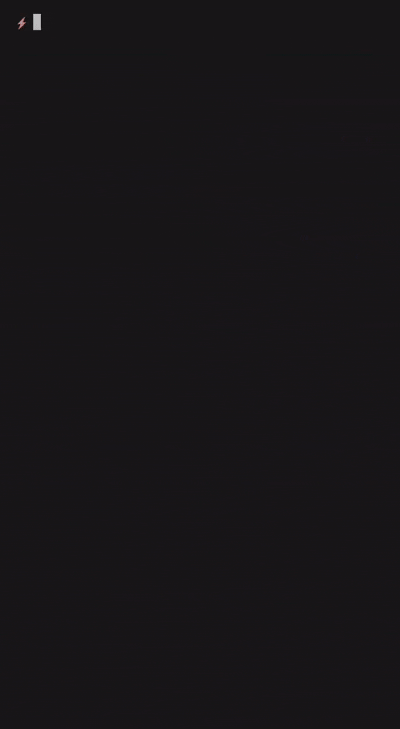

# Autoscript XRAY

## Features

| Category    | Features                                                                          |
| ----------- | --------------------------------------------------------------------------------- |
| SSH WS      | OpenSSH, Dropbear, SSH WS, SSH SSL WS, Enhanced Payload, UDP Custom, BadVPN UDPGW |
| XRAY Core   | VMess, VLESS, Trojan, Shadowsocks, gRPC, NGINX Reverse Proxy, Auto SSL            |
| WireGuard   | WireGuard VPN, Client Generator, QR Code                                          |
| UDP Tunnel  | UDP Custom, ZIVPN UDP, BadVPN UDPGW                                               |
| Management  | Backup, Domain Manager, Speedtest, Service Checker, Traffic Monitor               |
| Dashboard   | Interactive Panel, Service Status, User Statistics, Traffic Statistics            |
| Go Services | Native Dropbear WS, Native Stunnel WS, Multi-Connection Support                   |

---

## Screenshot



Open menu:

```bash
menu
```

---

## Quick Install

> Note: This script must be run as root!

```bash
# update
apt update -y && apt upgrade -y
apt install git curl screen sudo -y

# disable ipv6
sysctl -w net.ipv6.conf.all.disable_ipv6=1
sysctl -w net.ipv6.conf.default.disable_ipv6=1

# clone the repos
git clone https://github.com/znandev/AutoscriptXRAY.git
cd AutoscriptXRAY

# run main installer
chmod +x setup.sh
chmod +x uninstall.sh
screen -S setup ./setup.sh
```
---

## Default Ports

| Service        | Port    |
| -------------- | ------- |
| OpenSSH        | 22      |
| Dropbear       | 109,143 |
| SSH WS         | 2082    |
| SSH SSL WS     | 2096    |
| BadVPN UDPGW   | 7300    |
| UDP Custom     | 1-65535 |
| VMess TLS      | 443     |
| VMess None TLS | 80      |
| VLESS TLS      | 443     |
| Trojan TLS     | 443     |
| Shadowsocks WS | 443     |

---

## Debugging

Check listening ports:

```bash
ss -tulpn
```

Check NGINX:

```bash
nginx -t
systemctl status nginx
```

Check XRAY:

```bash
xray -test -config /etc/xray/config.json
systemctl status xray
```

Check SSH WS:

```bash
systemctl status ws-dropbear
systemctl status ws-stunnel
```

Check UDP Tunnel:

```bash
systemctl status udp-custom
systemctl status udpgw
```

---

## Compatibility

| OS           | Status        |
| ------------ | ------------- |
| Debian 12    | ⭐ Recommended |
| Debian 11    | ✅ Supported   |
| Ubuntu 22.04 | ✅ Supported   |
| Ubuntu 20.04 | ⚠ Limited     |
| Debian 10    | ❌ Deprecated  |
| OpenVZ       | ❌ Unsupported |
| KVM          | ✅ Recommended |
| VMware       | ✅ Recommended |

---

## ⚠ Notes

* Recommended fresh VPS installation
* Recommended minimum RAM 1GB
* Domain required for XRAY TLS
* Cloudflare supported
* Enhanced payload supported

---

## ❤️ Credits

* XTLS / Xray-core
* BadVPN
* WireGuard
* acme.sh
* NGINX
